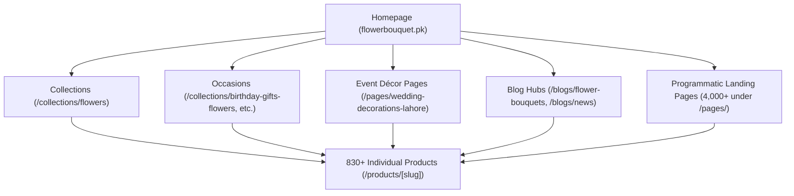

# Competitor Information Architecture Reverse-Engineering
**Target Competitor:** `https://flowerbouquet.pk/`  
**Platform:** Shopify  
**Crawl Date:** October 3, 2026  
**Auditor:** Senior Information Architect & E-commerce SEO Specialist  

---

## 1. High-Level Architectural Model

The competitor operates on a **flat Shopify catalog structure** augmented by an **aggressive programmatic URL generation strategy** containing over 5,632 public XML sitemap entries.

### Public Directory Breakdown
- **Root / Homepage:** `https://flowerbouquet.pk/`
- **Collections:** 109 URLs (`/collections/*`)
- **Products:** 830+ active URLs (`/products/*`)
- **Blog Content:** 430 articles across multiple blog hubs (`/blogs/*`)
- **Pages:** 4,261 URLs (`/pages/*`)
- **Policies:** Standard Shopify legal routes (`/policies/*`)

---

## 2. Reverse-Engineered Hierarchy & Discovery Paths



### Hierarchy A: Core Product Taxonomy
```
Homepage
  └── /collections/flowers (Main hub)
        ├── /collections/best-selling-flowers
        ├── /collections/all-products
        ├── /collections/crochet-flowers-bouquet
        ├── /collections/dry-flower-bouquets
        └── /collections/cakes-chocolates-in-lahore
              └── /products/[product-slug]
```
*Observation:* Shopify’s native routing places all individual products directly under `/products/[slug]`, rather than nesting them under `/collections/[cat]/products/[slug]`. This avoids duplicate URLs caused by collection-scoped product handles, which is a good technical SEO practice.

### Hierarchy B: Occasion Taxonomy
```
Homepage
  └── /collections/
        ├── /collections/birthday-gifts-flowers
        ├── /collections/anniversary-gifts-flowers
        ├── /collections/valentines-day-gifts-flowers
        ├── /collections/mothers-day-gifts-flowers
        ├── /collections/fathers-day-gifts-flowers
        ├── /collections/congratulations-gift-flowers
        ├── /collections/get-well-soon-gifts-flowers
        ├── /collections/eid-gifts-flowers
        ├── /collections/womens-day-gifts-flowers
        └── /collections/sympathy-gifts-flowers
              └── /products/[product-slug]
```
*Observation:* Occasions are implemented as standard Shopify Smart Collections, filtering products tagged with specific occasion keywords. This provides clean faceted navigation.

### Hierarchy C: Service & Event Décor Taxonomy
```
Homepage
  └── /pages/
        ├── /pages/wedding-decorations-lahore
        ├── /pages/car-decorations-lahore
        ├── /pages/gajray-garlands-mala-haar-lahore
        ├── /pages/birthday-decoration-services-in-lahore
        ├── /pages/nikah-decore-service
        ├── /pages/bridal-shower-decor
        └── /pages/baraat-decor-service
```
*Observation:* Unlike products, services and event decorations are built as standalone Shopify Pages (`/pages/...`) containing descriptive copy, service photos, pricing tiers, and WhatsApp contact CTAs.

### Hierarchy D: Programmatic Local Landing Pages (The "Doorway" Network)
```
Homepage / Sitemaps
  └── /pages/
        ├── /pages/flower-gift-delivery-in-dha-lahore
        │     ├── /pages/flower-gifts-delivery-in-dha-phase-1-lahore
        │     ├── /pages/flower-bouquet-delivery-in-dha-phase-2-lahore
        │     ├── /pages/flower-delivery-dha-phase-3-lahore
        │     ├── ... (Phases 1 through 12, Defence Raya, Rahbar)
        ├── /pages/flower-and-gifts-delivery-in-bahria-town-lahore
        ├── /pages/flower-gift-delivery-johar-town-lahore
        │     ├── /pages/send-flowers-and-gifts-with-in-johar-town-phase-1
        │     └── /pages/send-flower-bouquets-and-gifts-within-johar-town-phase-2
        ├── /pages/flower-gifts-delivery-model-town-lahore
        └── Multi-city pages (Karachi, Islamabad, Rawalpindi)
```
*Critical Evaluation:*  
The competitor has constructed over **4,116 programmatic variation pages** combining location names with product types (e.g. `flower-gift-delivery-for-wife-in-johar-town-phase-1`).  
- **Strength:** Captures ultra-long-tail local searches where zero competition exists.
- **Weakness / Vulnerability:** High risk of Google Helpful Content penalties and algorithmic demotion under Google's Spam Policies regarding Doorway Pages. The content on these pages is largely boilerplate text with dynamic location token swapping. Noticeable typos (e.g., lowercase `l` in `lslamabad` and truncated slugs like `birthday-event-de`) indicate unsupervised mass generation.

### Hierarchy E: Editorial & Blog Taxonomy
```
Homepage
  └── /blogs/
        ├── /blogs/flower-bouquets (Primary content hub)
        │     ├── /blogs/flower-bouquets/how-to-choose-the-perfect-bouquet-for-any-occasion
        │     ├── /blogs/flower-bouquets/top-online-florists-in-pakistan
        │     ├── /blogs/flower-bouquets/how-to-care-for-fresh-cut-flowers
        │     └── /blogs/flower-bouquets/birthday-gift-ideas-for-her
        └── /blogs/news
```
*Observation:* Competitor leverages 430 blog posts to target top-of-funnel queries, seasonal gifting guides, and flower care information. This drives significant organic backlinks and informational search traffic.

---

## 3. Structural Strengths & Weaknesses

| Architectural Dimension | Competitor Implementation | SEO Verdict |
| :--- | :--- | :--- |
| **Catalog Hierarchy** | Flat Shopify product structure (`/products/*`) | Clean canonicalization, no pagination traps |
| **Occasion Filtering** | Dedicated occasion collections | High commercial search intent capture |
| **Local Search Strategy** | 4,000+ programmatic `/pages/` | Aggressive footprint, but vulnerable to doorway penalties |
| **Content Strategy** | 430 blog articles linked to products | Builds strong topical authority in Pakistan |
| **Internal Linking** | Heavy footer links, related product carousels | Strong PageRank flow, some duplicate anchor stuffing |
