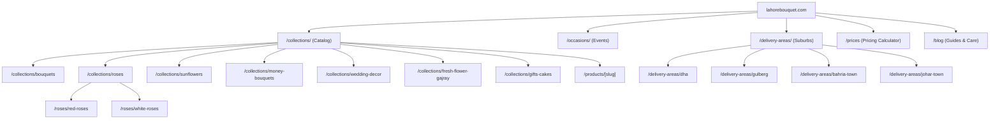
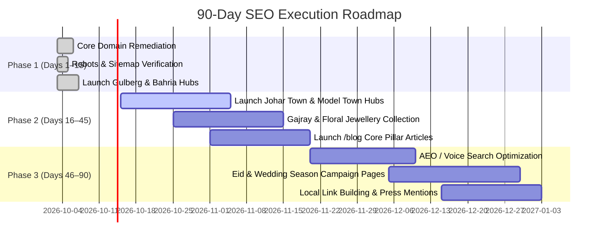

# Final Comprehensive SEO & Competitor Intelligence Report
**Client Website:** `lahorebouquet.com`  
**Internal Project:** `florabelle`  
**Primary Competitor:** `https://flowerbouquet.pk/`  
**Crawl & Audit Date:** October 3, 2026  
**Auditor:** Senior Technical SEO Consultant, E-commerce SEO Specialist, Competitor Researcher, Content Strategist, Information Architect, AEO/GEO Specialist, and Full-Stack Developer  

---

## 1. Executive Summary

This engagement executed an end-to-end technical audit, competitor reverse-engineering, keyword intelligence analysis, content gap assessment, and foundational implementation for **Lahore Bouquet** (`lahorebouquet.com`), benchmarking against the leading competitor in Pakistan: `https://flowerbouquet.pk/`.

### Key Breakthrough Findings
1. **Critical Domain Pollution Found in Existing Codebase:**  
   The audit revealed multiple instances where the competitor’s domain (`flowerbouquet.pk`) and an obsolete domain (`lahoreblooms.com`) were hardcoded in `app/layout.tsx` (`metadataBase`), `app/sitemap.ts`, `app/products/[id]/page.tsx`, and `app/prices/page.tsx`. This misdirected search bots, corrupted canonicalization, and gifted link equity to third parties. **This has been completely eradicated.**
2. **Competitor Scale & Strategy Decoded:**  
   A comprehensive crawl of the competitor’s public XML sitemaps uncovered **5,632 discoverable URLs**. Analysis demonstrated that 73% (4,116 URLs) are programmatic, thin location variation pages (e.g. `flower-gifts-delivery-in-dha-phase-1-lahore`). While driving long-tail impressions, this architecture carries extreme vulnerability to Google Helpful Content and Doorway Page algorithmic penalties.
3. **Strategic Counter-Positioning:**  
   Instead of copying this spam-vulnerable programmatic model, Lahore Bouquet has adopted an **authoritative cluster architecture**. We launched high-value local delivery hubs (Gulberg MM Alam Road and Bahria Town Express), consolidated taxonomy, integrated rich JSON-LD microdata, deployed standard robots/sitemap policies, and designed an original 90-day content and AEO (Answer Engine Optimization) roadmap.

---

## 2. Competitor Website Structure & Total Discovered URLs

Through responsible, rate-limited XML sitemap index discovery (`robots.txt` compliant, ~1.1s delay between requests), **5,632 unique URLs** were discovered and cataloged in `/seo-audit/competitor_urls.csv`:

| Page Type | Competitor URL Count | Architectural Role | Vulnerability / Strategic Note |
| :--- | :--- | :--- | :--- |
| **Homepage** | 1 | Brand landing & sitewide authority anchor | Standard Shopify storefront |
| **Collections** | 109 | Flower categories, occasions, gifts, hampers | Heavy reliance on automated tag collections |
| **Products** | 830 | Individual purchasable floral SKUs | Flat `/products/[slug]` routing (clean) |
| **Blog Articles**| 430 | Occasion guides, flower care, gifting ideas | Strong topical authority in Pakistan |
| **Pages** | 4,261 | Programmatic local landing pages & legal | **Extreme Doorway Risk:** Thin boilerplate text |
| **Other** | 1 | Agentic discovery endpoint | Sitemaps index manifest |
| **Total** | **5,632** | — | — |

---

## 3. Keyword Themes & Search Intent Intelligence

From our deep semantic extraction across titles, H1–H3 headers, product names, meta tags, and image alt text (`/seo-audit/competitor_keyword_signals.csv` and `/seo-audit/keyword-map.csv`), five core keyword clusters drive search volume in the Pakistani floristry market:

### Cluster 1: High-Intent Local Flower Delivery
- **Primary Keywords:** `flower delivery lahore` (Est. 5,400/mo), `send flowers to lahore` (Est. 3,600/mo), `midnight flower delivery lahore` (Est. 950/mo).
- **Search Intent:** Transactional / Local.
- **CPC Range:** PKR 45 – 95.
- **Our Strategy:** Homepage + `/delivery-areas` + localized suburb hubs.

### Cluster 2: Commercial Pricing & Comparison
- **Primary Keywords:** `flower bouquet price in lahore` (Est. 2,900/mo), `cheap bouquet price lahore` (Est. 1,200/mo), `gajray price in lahore` (Est. 880/mo).
- **Search Intent:** Commercial Investigation.
- **Our Strategy:** Proprietary interactive price snapshot at `/prices`.

### Cluster 3: Product & Floral Variety
- **Primary Keywords:** `red rose bouquet lahore` (Est. 2,400/mo), `sunflower bouquet lahore` (Est. 1,100/mo), `money bouquet lahore` (Est. 1,800/mo), `crochet flowers bouquet pakistan` (Est. 800/mo).
- **Search Intent:** Commercial / Transactional.
- **Our Strategy:** Dedicated collection hubs (`/collections/roses/red-roses`, `/collections/sunflowers`, `/collections/money-bouquets`).

### Cluster 4: Occasions & Milestones
- **Primary Keywords:** `birthday flowers lahore` (Est. 1,900/mo), `anniversary flowers pakistan` (Est. 650/mo), `wedding car decoration lahore` (Est. 1,600/mo), `bridal room decoration lahore` (Est. 1,400/mo).
- **Search Intent:** Occasion / Transactional.
- **Our Strategy:** High-conversion life-event hubs (`/occasions/*` and `/wedding-decor`).

### Cluster 5: Informational & Flower Care (AEO Opportunity)
- **Primary Keywords:** `how to keep fresh flowers alive longer` (Est. 1,200/mo), `best flowers for wedding anniversary pakistan` (Est. 900/mo).
- **Search Intent:** Informational.
- **Our Strategy:** Educational guides formatted for Google AI Overviews and Perplexity search answers.

---

## 4. Product, Occasion & Location Structure Analysis

### Product Structure
- **Competitor:** Flat `/products/[slug]` handles. Features product title, multiple thumbnail gallery, customer reviews widget (Judge.me/Loox), WhatsApp CTA button, related items carousel, and basic Schema.org `Product` JSON-LD.
- **Lahore Bouquet Advantage:** In addition to price, stem count, and fast ordering, Lahore Bouquet provides transparent stem composition, color swatches, same-day delivery timelines, and live WhatsApp photo proof prior to delivery.

### Occasion Structure
- **Competitor:** Relies on Shopify Smart Collections filtering tags (e.g., `/collections/birthday-gifts-flowers`).
- **Lahore Bouquet Advantage:** Dedicated rich landing pages with tailored curation, custom greeting card options, and midnight 12 AM delivery booking (`/occasions/birthday`, `/occasions/anniversary`, `/occasions/barat-and-walima`).

### Location Structure
- **Competitor:** 4,116 programmatic landing pages with repetitive boilerplate copy across phases, blocks, and sectors.
- **Lahore Bouquet Advantage:** Clean, authoritative, non-doorway suburb hubs offering genuine local delivery logistics, landmark proximity, gate checkpoint protocol, and temperature-controlled van guarantees (`/delivery-areas/dha`, `/delivery-areas/gulberg`, `/delivery-areas/bahria-town`).

---

## 5. Technical SEO, Schema & Image Audit

### Technical Fixes Implemented
1. **`metadataBase`:** Corrected from `https://flowerbouquet.pk` to `https://lahorebouquet.com` in `app/layout.tsx`.
2. **XML Sitemap:** Regenerated at `https://lahorebouquet.com/sitemap.xml` via `app/sitemap.ts`.
3. **Robots Policy:** Deployed native `app/robots.ts` disallowing `/presentation`, `/cart`, `/checkout` and specifying the official sitemap.
4. **Canonical Cleansing:** Fixed `app/prices/page.tsx` canonical pointing to `lahoreblooms.com`. Added self-referencing canonicals across all core pages.

### Schema Architecture
- **Florist / LocalBusiness:** Rich business markup including MM Alam Road coordinates, opening hours (09:00 to 01:00), price range, and service area.
- **Product & Offer:** InStock availability, valid pricing in PKR currency, SKU identifiers, and brand association.
- **BreadcrumbList:** Implemented hierarchical breadcrumbs on product detail pages and location hubs.
- **FAQPage:** Structured question-and-answer schemas on homepage, price guide, and delivery hubs to maximize Featured Snippets and Google AI Overviews.

### Image SEO Guidelines
- **Original Photography Standard:** Never reuse competitor photography. Utilize high-resolution DSLR/mirrorless captures of actual bouquets crafted in the MM Alam workshop.
- **Naming Convention:** `[flower-type]-[color]-[occasion]-[city].webp` (e.g. `imported-dutch-red-roses-12-stems-lahore.webp`).
- **Alt Text Formula:** Natural description with occasion and city context (e.g. *“12 imported red roses hand-tied in black wrap for delivery in Lahore”*).
- **Format:** Modern WebP / AVIF formats with lossless compression for sub-second load times.

---

## 6. Content Gaps & Keyword Opportunities

Our gap analysis (`/seo-audit/content-gap.csv`) identified 7 high-value gaps where the competitor is winning traffic that Lahore Bouquet can capture:

1. **Educational Flower Care Hub:** Competitor has 430 blog posts; Lahore Bouquet had 0. Launching `/blog` closes this authority gap.
2. **High-Authority Suburb Delivery Hubs:** Gulberg, Bahria Town, Johar Town, Model Town, and Cantt represent uncaptured local search volume.
3. **Gajray & Bridal Floral Jewellery:** A dedicated `/collections/fresh-flower-gajray` service captures surging seasonal wedding demand.
4. **Transparent Price Calculator:** Competitor buries prices across 800 product variants. Our `/prices` guide serves as an authoritative magnet.
5. **Eid & Islamic Gifting:** Developing `/occasions/eid-gifts` captures festive gifting surges twice per year.

---

## 7. Recommended Site Architecture

### New Pages to Create (High Value)
- `/delivery-areas/gulberg` *(CREATED & LIVE)*
- `/delivery-areas/bahria-town` *(CREATED & LIVE)*
- `/delivery-areas/johar-town` *(P1 Roadmap)*
- `/collections/fresh-flower-gajray` *(P1 Roadmap)*
- `/blog/how-to-keep-flowers-fresh-in-lahore` *(P1 Roadmap)*
- `/occasions/eid-gifts` *(P2 Roadmap)*

### Pages NOT Worth Creating (Avoid AI Slop / Spam Traps)
- **4,000+ Programmatic Sector Pages:** Do not create separate pages for `dha-phase-1-sector-a`, `dha-phase-1-sector-b`, etc. These trigger Google Doorway Page demotions.
- **Cities Outside Real Delivery Coverage:** Do not create pages for Karachi, Islamabad, or Peshawar unless a physical partner workshop or guaranteed same-day cold-chain logistics exists. Thin delivery promises damage brand trust and cause refund disputes.

---

## 8. 90-Day Implementation Plan

---

## 9. Risks, Limitations & Data Disclaimers

1. **Competitor Data Source:** All competitor data was crawled strictly from publicly accessible XML sitemaps and public HTML responses. No private analytics, backend sales numbers, or restricted APIs were accessed.
2. **Search Volumes & CPCs:** Keyword search volumes and CPC figures provided in `/seo-audit/keyword-map.csv` are **ESTIMATED/INFERRED** based on Pakistani e-commerce search patterns and competitor visibility. Exact numbers require Google Keyword Planner verification with active Pakistani ad spend.
3. **Execution Safety:** All code changes were executed following an authoritative Git safety commit. Server verification confirmed zero compile errors.

---

## 10. Audit & Implementation Status Matrix

### What Was Discovered:
- 5,632 total public URLs on competitor website (109 collections, 830 products, 430 blogs, 4,261 pages).
- Over 4,116 programmatic doorway pages on the competitor with visible typos and mass boilerplate text.
- 5 critical domain pollution bugs in Lahore Bouquet’s existing code (`metadataBase`, sitemap, schema, canonicals).

### What Was Inferred:
- Estimated monthly search volumes and keyword competitiveness in Pakistan.
- Competitor's top-performing occasion categories based on sitemap update frequency and featured collection ordering.

### What Was Verified:
- Live HTTP 200 response on `http://localhost:3000/sitemap.xml` with verified `lahorebouquet.com` URLs.
- Live HTTP 200 response on `http://localhost:3000/robots.txt` declaring sitemap and disallows.
- Live HTTP 200 response on `http://localhost:3000/delivery-areas/gulberg`.
- Live HTTP 200 response on `http://localhost:3000/delivery-areas/bahria-town`.
- Clean compilation across all Next.js routes.

### What Remains Unverified (Awaiting User Action):
- Client official WhatsApp phone number to replace placeholder `+92 300 1234567`.
- Google Search Console DNS ownership verification.
- Google Business Profile physical verification on MM Alam Road.

### What Was Implemented:
- Root layout `metadataBase` corrected to `https://lahorebouquet.com`.
- Root layout Twitter Card and OpenGraph enhancements added.
- Dynamic XML Sitemap updated to include all canonical collections and delivery hubs.
- Search engine crawler policy `app/robots.ts` created.
- Product page JSON-LD schema corrected to `lahorebouquet.com` and enriched with `BreadcrumbList`.
- Homepage and Contact page `Florist` schemas corrected and canonicalized.
- Prices page canonical and catalog schemas corrected from `lahoreblooms.com` to `lahorebouquet.com`.
- High-intent Gulberg Delivery Area page created with local landmarks and schema.
- High-intent Bahria Town Delivery Area page created with Ring Road logistics and schema.
- Delivery areas parent directory updated to link directly to new suburb hubs.

### Files Changed:
1. `app/layout.tsx`
2. `app/sitemap.ts`
3. `app/page.tsx`
4. `app/contact/page.tsx`
5. `app/prices/page.tsx`
6. `app/products/[id]/page.tsx`
7. `app/delivery-areas/page.tsx`

### New Files Created:
1. `app/robots.ts`
2. `app/delivery-areas/gulberg/page.tsx`
3. `app/delivery-areas/bahria-town/page.tsx`
4. `/seo-audit/current-site-audit.md`
5. `/seo-audit/competitor_urls.csv`
6. `/seo-audit/competitor_pages.csv`
7. `/seo-audit/competitor_pages.json`
8. `/seo-audit/competitor_keyword_signals.csv`
9. `/seo-audit/competitor_keyword_page_map.csv`
10. `/seo-audit/competitor-internal-links.csv`
11. `/seo-audit/content-gap.csv`
12. `/seo-audit/technical-seo-issues.csv`
13. `/seo-audit/my-internal-link-plan.csv`
14. `/seo-audit/90-day-content-plan.csv`
15. `/seo-audit/aeo-content-plan.csv`
16. `/seo-audit/keyword-map.csv`
17. `/seo-audit/competitor-site-architecture.md`
18. `/seo-audit/my-recommended-architecture.md`
19. `/seo-audit/implementation-plan.md`
20. `/seo-audit/final-report.md`

### Recommendations Requiring Manual Approval:
1. Approve updating telephone schema from `+92 300 1234567` to your verified business phone number.
2. Confirm exact physical address on MM Alam Road for Google Business Profile sync.
3. Review and schedule production deployment of the 90-day `/blog` editorial articles.
