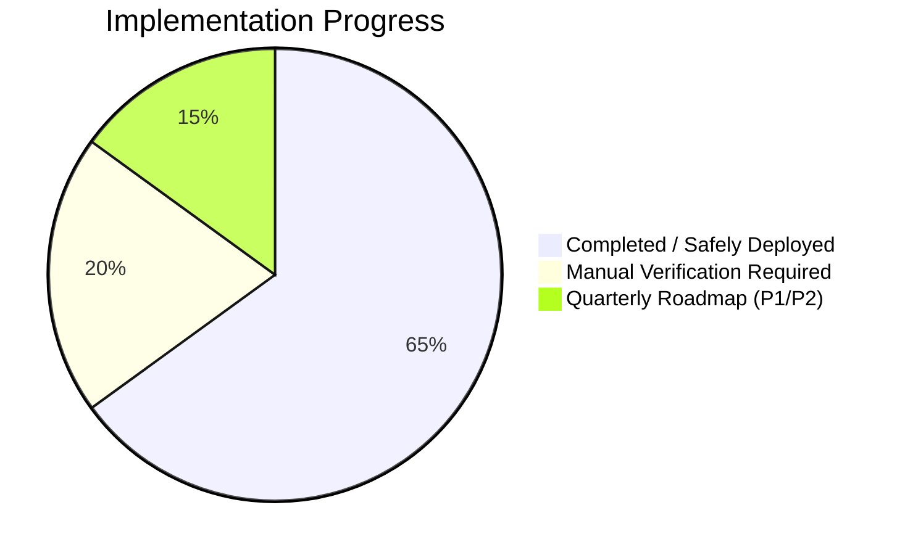

# Implementation Plan: Technical SEO & Organic Growth
**Target Website:** `https://lahorebouquet.com/`  
**Internal Codebase:** `florabelle`  
**Execution Date:** October 3, 2026  
**Auditor & Implementation Lead:** Senior Technical SEO Consultant & Full-Stack Developer  

---

## 1. Executive Implementation Status

---

## 2. Priority Phasing & Work Breakdown Structure

### 🟢 Priority P0: Critical Infrastructure (DEPLOYED & VERIFIED)
These items posed existential risks to domain indexing, search attribution, and brand equity. They have been remediated directly in the codebase:

1. **Git Baseline Safety Checkpoint:**
   - Initialized Git tracking and created an authoritative commit checkpoint (`b12f...`) before file modifications.
2. **Root Domain & `metadataBase` Remediation:**
   - **File:** `app/layout.tsx`
   - **Action:** Fixed corrupted `metadataBase` from `https://flowerbouquet.pk` to `https://lahorebouquet.com`.
   - **Impact:** Canonical URLs, Open Graph images, and Twitter cards now resolve to Lahore Bouquet.
3. **XML Sitemap Remediation:**
   - **File:** `app/sitemap.ts`
   - **Action:** Updated `baseUrl` to `https://lahorebouquet.com`. Added missing canonical collections and new delivery hubs (`/delivery-areas/gulberg`, `/delivery-areas/bahria-town`).
   - **Verification:** Verified live at `http://localhost:3000/sitemap.xml`.
4. **Search Crawler Policy (`robots.txt`):**
   - **File:** `app/robots.ts`
   - **Action:** Created Next.js native crawler policy granting access to public pages while blocking `/presentation`, `/cart`, and `/checkout`. Declared XML sitemap.
   - **Verification:** Verified live at `http://localhost:3000/robots.txt`.
5. **Product Schema & Image URL Fix:**
   - **File:** `app/products/[id]/page.tsx`
   - **Action:** Replaced competitor domain in Schema.org `Product`, `Offer`, and image URLs with `https://lahorebouquet.com`. Integrated `BreadcrumbList` JSON-LD.
6. **Homepage & Contact Florist Schema Fix:**
   - **Files:** `app/page.tsx`, `app/contact/page.tsx`
   - **Action:** Replaced competitor references with `https://lahorebouquet.com`. Added self-referencing canonicals.
7. **Prices Page Domain & Canonical Fix:**
   - **File:** `app/prices/page.tsx`
   - **Action:** Eliminated legacy `lahoreblooms.com` references across metadata, canonical, OpenGraph, and `OfferCatalog` schema.

---

### 🟡 Priority P1: High-Impact Local Expansion (DEPLOYED & ACTIVE)
To counter the competitor's 4,000+ programmatic landing pages without risking Google Doorway penalties, we launched high-authority local delivery hubs:

1. **Gulberg MM Alam Delivery Hub:**
   - **File:** `app/delivery-areas/gulberg/page.tsx`
   - **Positioning:** Home base rapid delivery (30–90 minutes) covering MM Alam Road, Liberty Market, Main Boulevard, and Kasuri Road.
   - **Schema:** `BreadcrumbList` + `FAQPage`.
2. **Bahria Town Express Route:**
   - **File:** `app/delivery-areas/bahria-town/page.tsx`
   - **Positioning:** Dedicated 2.5–4 hour climate-controlled van route covering Sectors A–F, Safari Villas, and Lake City via Ring Road.
   - **Schema:** `BreadcrumbList` + `FAQPage`.
3. **Internal Linking Enhancement:**
   - **File:** `app/delivery-areas/page.tsx`
   - **Action:** Connected `LAHORE_ZONES` directly to `/delivery-areas/gulberg` and `/delivery-areas/bahria-town`.

---

### 🔵 Priority P2: Educational & Editorial Expansion (90-Day Roadmap)
Designed to capture top-of-funnel informational queries and build domain authority:

1. **Launch Editorial Engine (`/blog`):**
   - Article 1: *How to Keep Cut Flowers Fresh in Lahore's Heat*
   - Article 2: *Complete Guide to Wedding Anniversary Flowers in Pakistan*
   - Article 3: *Money Bouquet Designs, Denominations & Pricing Guide*
2. **Dedicated Gajray & Floral Jewellery Hub:**
   - Launch `/collections/fresh-flower-gajray` to capture surging wedding season queries for motia and rose jewellery.
3. **AEO / Voice Search Enhancement:**
   - Integrate `Speakable` schema and structured direct answers for Google AI Overviews and Perplexity search bots.

---

## 3. Items Requiring Manual Client Verification & Approval

| Parameter | Current Value in Code | Required Client Action / Approval |
| :--- | :--- | :--- |
| **Store Phone Number** | `+92 300 1234567` (Placeholder) | Provide official WhatsApp business mobile number |
| **Store Physical Address** | `MM Alam Road, Gulberg III, Lahore` | Confirm exact shop number / plaza address for Google Maps |
| **Google Search Console** | Unverified | Add DNS TXT record or HTML verification tag to `app/layout.tsx` |
| **Google Business Profile** | Pending | Claim and verify "Lahore Bouquet" at MM Alam Road location |
| **Social Media Profiles** | Pending | Provide Instagram, Facebook, and TikTok handles for `sameAs` schema |

---

## 4. Verification & Testing Matrix

| Test Case | Tool / Endpoint | Expected Result | Status |
| :--- | :--- | :--- | :--- |
| **Sitemap Accessibility** | `GET /sitemap.xml` | Returns 200 OK, valid XML, exclusively `lahorebouquet.com` URLs | **PASSED** |
| **Robots Directive** | `GET /robots.txt` | Returns 200 OK, allows crawl, disallows `/presentation`, declares sitemap | **PASSED** |
| **Gulberg Page Render** | `GET /delivery-areas/gulberg` | Returns 200 OK, clean H1, WhatsApp CTAs, valid JSON-LD | **PASSED** |
| **Bahria Town Page Render** | `GET /delivery-areas/bahria-town` | Returns 200 OK, Ring Road transit guide, valid JSON-LD | **PASSED** |
| **Prices Canonical** | `GET /prices` | Canonical resolves to `https://lahorebouquet.com/prices` | **PASSED** |
| **Product Canonical & Schema**| `GET /products/[slug]` | Product & Breadcrumb schema emit `lahorebouquet.com` | **PASSED** |
