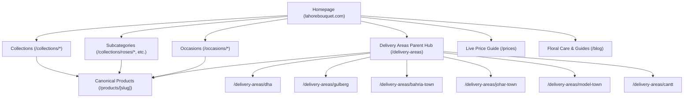

# Superior Information Architecture for Lahore Bouquet
**Target Website:** `https://lahorebouquet.com/`  
**Framework:** Next.js 16 App Router  
**Design Philosophy:** Quality over Programmatic Quantity, Topical Authority, Non-Doorway Local Hubs, Entity-First SEO  

---

## 1. Architectural Strategy & Philosophy

Rather than replicating the competitor’s 4,000+ thin, spam-vulnerable programmatic doorway pages, **Lahore Bouquet** will adopt an **authoritative cluster architecture**. Every single page will provide genuine local utility, accurate delivery time estimates, high-resolution original photography, transparent PKR pricing, and direct WhatsApp concierge ordering.

---

## 2. Directory Structure & URL Taxonomy

### Tier 1: Core E-Commerce Catalog (`/collections/`)
We establish `/collections/` as the single canonical taxonomy (and provide clean 301 redirects for any root paths like `/bouquets` to prevent duplicate indexing).

| Canonical URL | Page Role | Target Query Intent | Primary Schema |
| :--- | :--- | :--- | :--- |
| `/collections/bouquets` | Master catalog of hand-tied bouquets | "flower bouquets lahore", "buy bouquet online" | `CollectionPage`, `ItemList` |
| `/collections/roses` | Rose specialist collection | "fresh roses lahore", "rose flower delivery" | `CollectionPage`, `ItemList` |
| `/collections/roses/red-roses` | High-intent red rose subcollection | "red rose bouquet lahore", "imported roses" | `CollectionPage`, `ItemList` |
| `/collections/roses/white-roses` | White rose subcollection | "white rose bouquet lahore", "peace flowers" | `CollectionPage`, `ItemList` |
| `/collections/sunflowers` | Sunflowers & cheerful mixed blooms | "sunflower bouquet lahore", "yellow flowers" | `CollectionPage`, `ItemList` |
| `/collections/money-bouquets` | Handcrafted cash/currency arrangements | "money bouquet lahore price", "cash flower bouquet" | `CollectionPage`, `ItemList` |
| `/collections/wedding-decor` | Stage, car & bridal room floral setups | "wedding car decoration lahore", "bridal room decor" | `Service`, `FAQPage` |
| `/collections/fresh-flower-gajray` | Handcrafted motia & rose garlands | "fresh gajray lahore", "mehndi flower jewellery" | `CollectionPage`, `Product` |
| `/collections/gifts-cakes` | Gourmet cakes, chocolates, hampers | "flowers and cake delivery lahore", "gift combos" | `CollectionPage`, `ItemList` |
| `/collections/crochet-bouquets` | Everlasting yarn handcrafted florals | "crochet bouquet pakistan", "handmade flowers" | `CollectionPage`, `ItemList` |
| `/collections/dried-flowers` | Long-lasting preserved botanicals | "dried flowers lahore", "preserved flower vase" | `CollectionPage`, `ItemList` |

---

### Tier 2: Product Detail Pages (`/products/[slug]`)
Products reside exclusively at the canonical level `/products/[slug]`.
- **URL Structure:** `/products/[kebab-case-product-slug]` (e.g., `/products/eucalyptus-and-rose-bouquet-in-lahore`)
- **Routing Rules:** `/products/[id]` numeric routes (e.g. `/products/1`) strictly emit a canonical tag pointing to `/products/[slug]`, or 301 redirect to the slug version.
- **Structured Data:** Full Schema.org `Product` with `Offer`, real `priceCurrency: "PKR"`, actual `availability`, and `BreadcrumbList`.

---

### Tier 3: Occasions Cluster (`/occasions/`)
Dedicated high-conversion seasonal and life-event landing pages.

| Canonical URL | Occasion Focus | Local Gifting Angle |
| :--- | :--- | :--- |
| `/occasions/birthday` | Birthday celebrations & midnight surprises | 12 AM delivery, birthday greeting cards, cake combos |
| `/occasions/anniversary` | Romantic milestone celebrations | Long-stem imported roses, custom ribbons, photo proof |
| `/occasions/love-and-romance` | Romantic declarations & date nights | Velvet red roses, gypsophila, chocolate bundles |
| `/occasions/barat-and-walima` | Wedding ceremonies & stage florals | Stage setup, bridal car décor, fresh gajray |
| `/occasions/congratulations` | Graduations, promotions, newborn babies | Cheerful sunflowers, colorful spray roses, gift baskets |
| `/occasions/get-well-and-sorry` | Hospital deliveries & heartfelt apologies | Soft pastel bouquets, fragrance-safe blooms, prompt delivery |
| `/occasions/eid-gifts` | Eid ul Fitr & Eid ul Adha family gifting | Traditional jasmine hampers, fruit & dry fruit arrangements |

---

### Tier 4: Authentic Local Delivery Hubs (`/delivery-areas/`)
**Anti-Doorway Policy:** Instead of mass-generating 4,000 thin pages for every street and block, we create 6 meticulously crafted, authoritative suburb hubs that provide genuine local logistics value.

| Suburb URL | Neighborhoods Covered | Transit Advantage / Proof |
| :--- | :--- | :--- |
| `/delivery-areas` | Master delivery directory & map of Lahore | Lahore-wide delivery protocol, temperature-controlled vans |
| `/delivery-areas/dha` | DHA Phases 1–9, Sector Y, Raya, Phase 5 | 2–3 hour delivery via Ring Road, midnight slot availability |
| `/delivery-areas/gulberg` | Gulberg I, II, III, MM Alam, Liberty, Main Blvd | **Home Base Advantage:** 30–60 minute rapid express delivery |
| `/delivery-areas/bahria-town` | Bahria Sectors A–F, Safari Villas, Lake City | Direct Ring Road corridor, early morning & evening slots |
| `/delivery-areas/johar-town` | Johar Town Phases 1–2, Shaukat Khanum, Emporium | Hospital delivery clearance, express local routing |
| `/delivery-areas/model-town` | Model Town Blocks A–M, Garden Town, Link Road | Proximity express corridor via Ferozepur Road |
| `/delivery-areas/cantt` | Cantt, Saddar, Cavalry Ground, PAF Colony | Secure military gate checkpoint delivery protocol |

---

### Tier 5: Pricing & Commercial Calculator (`/prices`)
- **Canonical URL:** `/prices`
- **Role:** High-intent commercial magnet for "flower bouquet price in lahore".
- **Features:** Real-time starting price table, breakdown by flower type (local vs imported Dutch roses), seasonal price fluctuations during Valentine's / wedding seasons, and direct quote calculator via WhatsApp.

---

### Tier 6: Educational & Topical Authority Hub (`/blog/`)
To surpass the competitor’s 430 blog posts without creating AI slop, we publish deep, highly practical, locally tailored floral guides:
- `/blog/how-to-keep-flowers-fresh-in-lahore` — Tackling extreme summer climate, hard tap water, and AC room temperature.
- `/blog/anniversary-flower-guide-pakistan` — Traditional vs modern floral gifting in Pakistani culture.
- `/blog/money-bouquet-designs-and-pricing-lahore` — Sourcing crisp currency, legal guidelines, and presentation.
- `/blog/wedding-car-decoration-trends-lahore` — Bonnet florals, ribbon styling, and protection against car paint scratches.

---

## 3. Comparison: Competitor vs Lahore Bouquet

| Feature | Competitor (`flowerbouquet.pk`) | Lahore Bouquet (`lahorebouquet.com`) |
| :--- | :--- | :--- |
| **Total URLs** | 5,632 (overwhelmingly thin programmatic pages) | ~60 highly authoritative, deeply optimized URLs |
| **Doorway Risk** | **Extreme** (4,116 programmatic variation pages) | **Zero** (All location hubs offer genuine local logistical data) |
| **Domain Integrity**| Single Shopify domain | Unified `lahorebouquet.com` across metadata & schema |
| **Pricing Transparency**| Hidden in individual product variants | Dedicated interactive `/prices` guide |
| **Local Presence**| Generic nationwide delivery claims | Authentic florist shop on MM Alam Road, Gulberg III |
| **AEO / Voice Search**| Minimal conversational schema | Explicit `FAQPage` + `Speakable` schema targeting AI engines |
